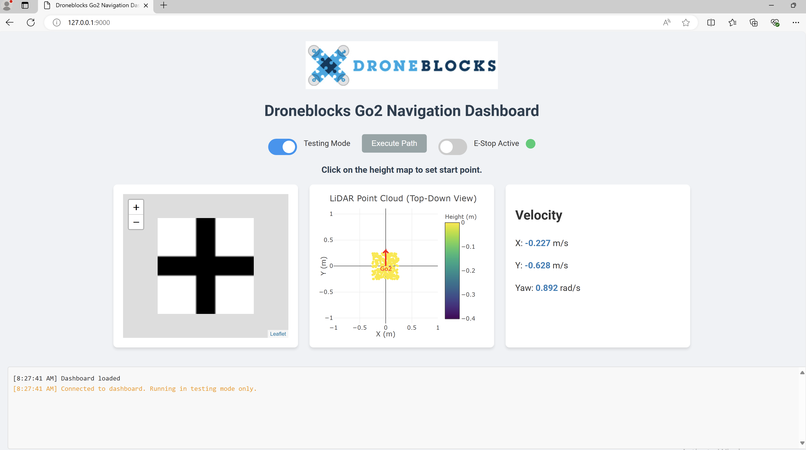

# Go2 Applications: Sensing and Navigation

## Table of Contents
1. [ROSBags](#rosbags)
   - [Working with ROSbags](#working-with-rosbags)
2. [Dashboard](#dashboard)
   - [Running the dashboard locally](#running-the-dashboard-locally)
   - [Running the dashboard on Go2](#running-the-dashboard-on-go2)
   - [Dashboard elements](#dashboard-elements)


## ROS

### Connect to the Go2

Use an ethernet cord to connect your computer to the Go2.

Set up a static IP address (https://kb.netgear.com/27476/How-do-I-set-a-static-IP-address-in-Windows) with settings:
- IP address: `192.168.123.99`
- Subnet mask: `255.255.255.0`
- Default gateway: `192.168.123.0`
- DNS Server: `8.8.8.8`

### Ensure ROS Installation

While connected to the Go2, ssh to the Go2 onboard computer using
```
ssh unitree@192.168.123.18
```
with the default password `123`.

When you enter you may see a prompt:
```
ros:foxy(1) noetic(2) ?
```
You should press 1 and then enter. (Foxy is a release of ROS2, Noetic is an older version of ROS.)

Finally, you'll need to run a command to initialize Unitree's ROS library.
```
source /home/unitree/unitree_ros2/setup.sh
```


### Working with ROSbags

<b>What is a ROSBag?</b> A ROSbag is a file that records all of the messages that were published on your robot over some duration of time. If you record one while running your robot, you can use it to play back the robot's experience on a different machine, like your laptop.

Your Unitree Go2's Ubuntu computer comes preinstalled with ROS, specifically ROS2. I'm going to assume you're using a Windows machine to SSH to the robot, and I don't recommend installing ROS on windows since it can be quite a pain. Instead, I've provided a python script `ros2_bagpy.py` that reads rosbags and works cross-platform without requiring a ROS installation.

List the topics in the example rosbag:
```
python .\ros2_bagpy.py rosbags/rosbag_example.bag list
```

Print the lidar cloud messages in the example rosbag:
```
python .\ros2_bagpy.py rosbags/rosbag_example.bag echo -t /utlidar/cloud_deskewed -n 10
```

List the topics on the robot:
```
ssh unitree@192.168.123.18
source /home/unitree/unitree_ros2/setup.sh
ros2 topic list
```

Record a ROSbag on the robot:
```
ssh unitree@192.168.123.18
source /home/unitree/unitree_ros2/setup.sh
ros2 bag record -o 'rosbag_latest.bag' topic /utlidar/cloud_deskewed
```

Download a ROSbag from the robot
```
scp -r "unitree@192.168.123.18:/home/unitree/rosbag_latest.bag" "./rosbags"
```

## Dashboard

### Running the dashboard locally
You can run the following python command to start the dashboard:
```
python dbdash_server.py
```
In the printout, you will see:
```
 * Running on http://127.0.0.1:9000
 ```
 Then you can go to your favorite web browser, type this into the address bar, and hit enter. The dashboard will load just like a website in your browser window. As it's running on your local machine, it'll show some spoofed data instead of sensor data from your robot.

 

### Running the dashboard on Go2
First, with your dog's ethernet connected, run this command on your local computer to transfer the dashboard files to the dog:
```
scp -r dbdash_dashboard.html dbdash_server.py unitree@192.168.123.18:/home/unitree
```
Next, ssh into the dog and run the dashboard there:
```
ssh unitree@192.168.123.18
python dbdash_server.py
```
Now, open your favorite web browser on your laptop. Type into the address bar: `http://192.168.123.18:9000`. The dashboard will load just like a website in your browser window. And this time, it's running on the dog so you'll see the live sensor data.


